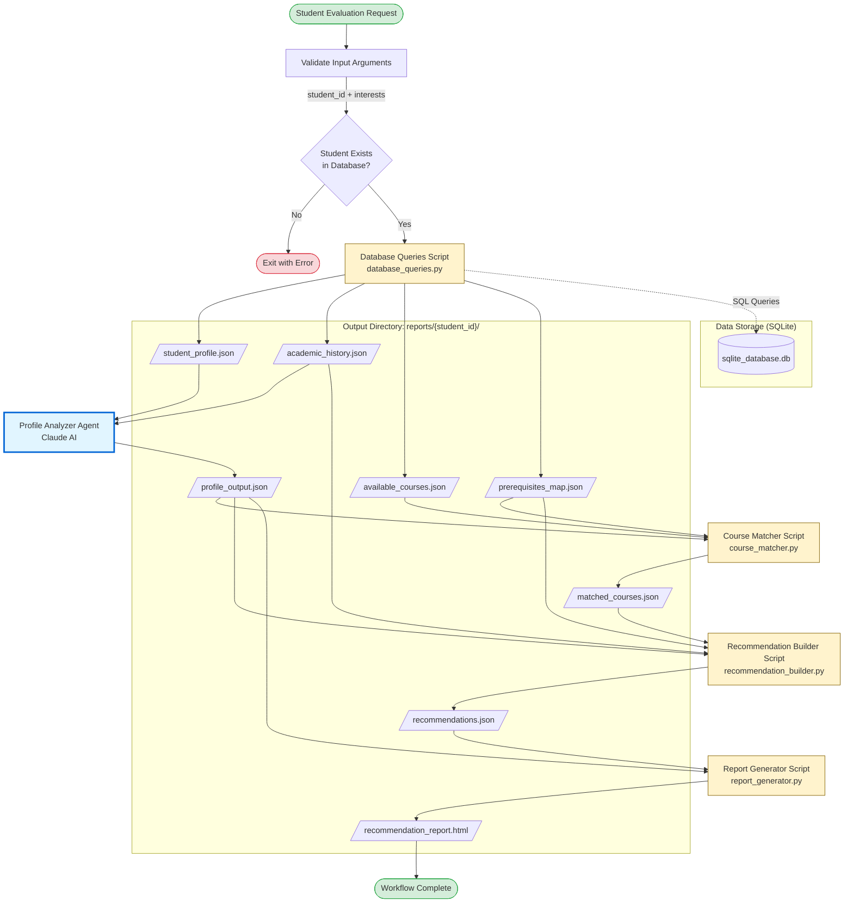
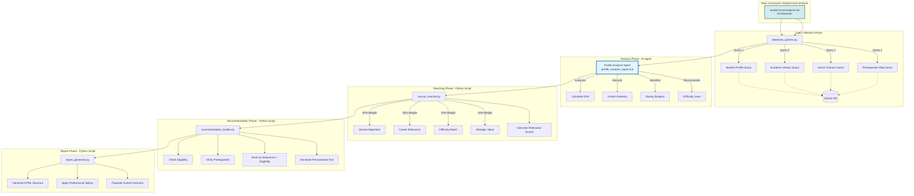

# Multi-Agent Course Recommendation Workflow Architecture

## 1. Overview

### System Description

This project implements a sophisticated **multi-agent orchestration system** for personalized academic course recommendations. The system analyzes student academic history, interests, and career goals to provide tailored course suggestions with comprehensive prerequisite verification and enrollment guidance.

### AI Coding CLI Tool Used

**Primary Tool**: Claude Code CLI / Gemini CLI
- The workflow is built using the `.claude` framework which is compatible with both **Claude Code CLI** and **Gemini CLI**
- The reflection notes indicate that **Gemini CLI** was used for multi-agent orchestration during development
- The system uses Claude AI models (Haiku 4.5 and Sonnet 4.5) for agent execution
- GitHub Copilot was used during development for code generation assistance

### Workflow Purpose

The workflow performs the following high-level operations:
1. **Student Profile Analysis** - Evaluates academic performance, interests, and career goals
2. **Course Matching** - Scores and ranks courses based on multi-criteria relevance analysis
3. **Recommendation Generation** - Creates personalized course recommendations with prerequisite verification
4. **Report Creation** - Generates professional HTML reports for students and advisors

---

## 2. Mermaid Diagram



### Detailed Agent Flow



---

## 3. Components Table

### Main Components

| Type | Name | Purpose | Dependencies |
|------|------|---------|--------------|
| **Main Workflow** | `student-eval-analysis.md` | Orchestrates the entire multi-agent pipeline | Claude/Gemini CLI, SQLite, all agents |
| **AI Agent** | `profile_analyzer_agent.md` | Analyzes student history, calculates GPA, extracts interests | `student_profile.json`, `academic_history.json` |
| **AI Agent** | `course_matcher_agent.md` | Scores and ranks courses using weighted criteria | `profile_output.json`, `available_courses.json` |
| **AI Agent** | `recommendation_builder_agent.md` | Creates personalized recommendations with prerequisites | `profile_output.json`, `matched_courses.json`, `academic_history.json` |

### Python Scripts

| Name | Purpose | Dependencies |
|------|---------|--------------|
| `database_queries.py` | Executes 4 SQL queries to extract data | SQLite database |
| `course_matcher.py` | Implements course scoring algorithm | `profile_output.json`, `available_courses.json` |
| `recommendation_builder.py` | Builds recommendations with prerequisite checks | `profile_output.json`, `matched_courses.json`, `academic_history.json` |
| `report_generator.py` | Generates professional HTML report | `profile_output.json`, `recommendations.json` |

### Database Tables

| Table | Purpose | Dependencies |
|-------|---------|--------------|
| `Students` | Student profile, GPA, major, classification | None |
| `AcademicHistory` | Completed courses with grades | Students, Courses |
| `Courses` | Course catalog with descriptions, difficulty | Departments, DifficultyLevels |
| `Prerequisites` | Course prerequisite requirements | Courses |
| `Departments` | Academic departments/schools | None |
| `DifficultyLevels` | Course difficulty scale (1-5) | None |
| `Classification` | Student classification levels | None |

### Output Files

| File | Purpose | Generated By |
|------|---------|--------------|
| `student_profile.json` | Raw student profile data | Database queries |
| `academic_history.json` | Completed courses list | Database queries |
| `available_courses.json` | All active courses | Database queries |
| `prerequisites_map.json` | Prerequisite mappings | Database queries |
| `profile_output.json` | Student analysis | Profile Analyzer Agent |
| `matched_courses.json` | Top 12 scored courses | Course Matcher Script |
| `recommendations.json` | Top 5 recommendations | Recommendation Builder |
| `recommendation_report_{id}_{timestamp}.html` | Final HTML report | Report Generator |

---

## 4. Tool Usage

### Built-in Tools Used

| Category | Tools | Usage |
|----------|-------|-------|
| **File I/O** | `open()`, `json.load()`, `json.dump()` | Read/write JSON files |
| **Database** | SQLite3 library | Execute SQL queries |
| **CLI Arguments** | `sys.argv` | Accept command parameters |
| **JSON Processing** | `json` module | Serialize/deserialize data |
| **String Manipulation** | Python string methods | Text processing and matching |
| **Date/Time** | `datetime` module | Generate timestamps |
| **File System** | `os` module | Directory management |
| **List Operations** | List comprehensions, sorting | Rank and filter courses |
| **Math Operations** | Arithmetic operators | Calculate GPA and scores |

### MCP Servers Configured

**None** - The project currently does not use any MCP (Model Context Protocol) servers.

**Potential Future Enhancement** (noted in reflection):
- MCP server for live university system integration
- Real-time course availability tracking
- Enrollment caps and waitlist management
- Live transcript data access
- Registration system integration

### Custom Tools Created

| Tool | Type | Purpose | Key Details |
|------|------|---------|-------------|
| **Database Query Tool** | Python Script | Execute 4 SQL queries | Parameterized queries in `database_queries.py` |
| **Course Scoring** | Python Script | Multi-criteria scoring | 40% interest + 30% career + 20% difficulty + 10% strategy |
| **Prerequisite Checker** | Python Script | Validate eligibility | Compare requirements vs completed courses |
| **Report Generator** | Python Script | Create HTML reports | Template-based with embedded CSS |

### External APIs or Services Integrated

**None** - The workflow is entirely self-contained and operates on local data.

**Current External Dependencies**:
- Claude/Gemini CLI for AI agent orchestration
- Claude AI API (via CLI) for natural language understanding and analysis
- SQLite database engine (embedded, not external service)

**No External Services Used**:
- ❌ No web APIs
- ❌ No cloud services
- ❌ No third-party SaaS integrations
- ❌ No external AI model APIs (all through Claude CLI)

---

## 5. Data Flow

### Input Requirements

| Input | Source | Format | Example |
|-------|--------|--------|---------|
| **Student ID** | User command argument | Integer/String | `10001` |
| **Interests & Goals** | User command argument | Natural language text | `"accounting and computer science"` |
| **Student Profile** | SQLite database | SQL query result → JSON | Student name, GPA, major, classification |
| **Academic History** | SQLite database | SQL query result → JSON | List of completed courses with grades |
| **Course Catalog** | SQLite database | SQL query result → JSON | All active courses with descriptions |
| **Prerequisites Map** | SQLite database | SQL query result → JSON | Course prerequisite requirements |

### Data Movement Between Agents

```
┌─────────────────────────────────────────────────────────────────────┐
│  STAGE 1: Data Collection (database_queries.py)                     │
│  ┌──────────────┐                                                   │
│  │ SQLite DB    │ ──SQL──> student_profile.json                     │
│  │              │ ──SQL──> academic_history.json                    │
│  │              │ ──SQL──> available_courses.json                   │
│  └──────────────┘ ──SQL──> prerequisites_map.json                   │
└─────────────────────────────────────────────────────────────────────┘
                                    │
                                    ▼
┌─────────────────────────────────────────────────────────────────────┐
│  STAGE 2: Profile Analysis (Manual Claude AI Agent)                 │
│  Input:  student_profile.json + academic_history.json + interests   │
│  Agent:  Profile Analyzer Agent (profile_analyzer_agent.md)         │
│  Process:                                                            │
│    - Calculate GPA from grades (A=4.0, B=3.0, etc.)                 │
│    - Identify strong subjects (high grades)                          │
│    - Extract interests from natural language query                   │
│    - Infer career goals from interests                               │
│    - Recommend difficulty level based on GPA                         │
│  Output: profile_output.json                                         │
│    {                                                                 │
│      student_id, gpa, strong_subjects[], interests[],               │
│      career_goals, preferred_difficulty, analysis_summary            │
│    }                                                                 │
└─────────────────────────────────────────────────────────────────────┘
                                    │
                                    ▼
┌─────────────────────────────────────────────────────────────────────┐
│  STAGE 3: Course Matching (course_matcher.py)                       │
│  Input:  profile_output.json + available_courses.json               │
│  Process:                                                            │
│    - For each course, calculate relevance score:                     │
│      • Interest Alignment (40%): keyword matching                    │
│      • Career Relevance (30%): career goal alignment                 │
│      • Difficulty Match (20%): difficulty level proximity            │
│      • Strategic Value (10%): builds on strengths                    │
│    - Sort courses by relevance_score (descending)                    │
│    - Select top 12 courses                                           │
│  Output: matched_courses.json                                        │
│    [                                                                 │
│      {course_id, course_code, course_name, description,              │
│       credits, difficulty_level, prerequisites[],                    │
│       relevance_score, match_reasoning}                              │
│    ]                                                                 │
└─────────────────────────────────────────────────────────────────────┘
                                    │
                                    ▼
┌─────────────────────────────────────────────────────────────────────┐
│  STAGE 4: Recommendation Building (recommendation_builder.py)       │
│  Input:  profile_output.json + matched_courses.json +               │
│          academic_history.json + prerequisites_map.json              │
│  Process:                                                            │
│    - For each of top matched courses:                                │
│      • Check if already completed → skip                             │
│      • Check prerequisite eligibility                                │
│      • Mark as "eligible" or "prerequisites_needed"                  │
│      • Generate personalized recommendation text                     │
│      • Suggest optimal enrollment semester                           │
│    - Prioritize eligible courses                                     │
│    - Include up to 2 prerequisite-needed courses if highly relevant  │
│    - Create prerequisite roadmap                                     │
│  Output: recommendations.json                                        │
│    {                                                                 │
│      recommendations: [                                              │
│        {rank, course_code, eligibility_status,                       │
│         missing_prerequisites[], recommendation_text,                │
│         suggested_semester}                                          │
│      ],                                                              │
│      prerequisites_to_prioritize: [{course_code, reason}]            │
│    }                                                                 │
└─────────────────────────────────────────────────────────────────────┘
                                    │
                                    ▼
┌─────────────────────────────────────────────────────────────────────┐
│  STAGE 5: Report Generation (report_generator.py)                   │
│  Input:  profile_output.json + recommendations.json                 │
│  Process:                                                            │
│    - Load HTML template with embedded CSS                            │
│    - Populate executive summary (student info, GPA, major)           │
│    - Add profile analysis section                                    │
│    - Create course recommendation cards with color-coded status      │
│    - Add prerequisite roadmap                                        │
│    - Include next steps and advisor contact info                     │
│    - Generate timestamp for filename                                 │
│  Output: recommendation_report_{student_id}_{timestamp}.html         │
│    Professional HTML report viewable in any browser                  │
└─────────────────────────────────────────────────────────────────────┘
```

### Output Artifacts

| Output Type | Filename | Location |
|-------------|----------|----------|
| **Student Profile** | `student_profile.json` | `reports/{student_id}/` |
| **Academic History** | `academic_history.json` | `reports/{student_id}/` |
| **Available Courses** | `available_courses.json` | `reports/{student_id}/` |
| **Prerequisites Map** | `prerequisites_map.json` | `reports/{student_id}/` |
| **Profile Analysis** | `profile_output.json` | `reports/{student_id}/` |
| **Matched Courses** | `matched_courses.json` | `reports/{student_id}/` |
| **Recommendations** | `recommendations.json` | `reports/{student_id}/` |
| **Final Report** | `recommendation_report_{id}_{timestamp}.html` | `reports/{student_id}/` |

### Data Validation and Quality

| Stage | Validation | Error Handling |
|-------|------------|----------------|
| **Input Validation** | Verify arguments provided | Exit with usage message |
| **Database Query** | Check student exists | Exit with error |
| **JSON Parsing** | Validate JSON structure | Display parsing errors |
| **Agent Output** | Ensure JSON-only output | Strict prompts |
| **Prerequisite Check** | Verify prerequisites exist | Skip invalid ones |
| **Report Generation** | Validate required fields | Use "N/A" for missing |

---

## 6. Decision Points and Control Flow

### Main Workflow Decision Tree

```
START
  │
  ├─> Arguments provided? ──NO──> Display usage, EXIT
  │         │
  │        YES
  │         │
  ├─> Student exists in DB? ──NO──> Display error, EXIT
  │         │
  │        YES
  │         │
  ├─> Create output directory: reports/{student_id}/
  │
  ├─> Execute database_queries.py
  │     │
  │     ├─> Query 1: Student Profile ──> student_profile.json
  │     ├─> Query 2: Academic History ──> academic_history.json
  │     ├─> Query 3: Available Courses ──> available_courses.json
  │     └─> Query 4: Prerequisites Map ──> prerequisites_map.json
  │
  ├─> Manual Profile Analysis (Claude Agent)
  │     │
  │     ├─> Load student_profile.json + academic_history.json
  │     ├─> Calculate GPA from grades
  │     ├─> Identify strong subjects (grades >= B+)
  │     ├─> Extract interests from user query (NLP)
  │     ├─> Infer career goals from interests
  │     ├─> Recommend difficulty level:
  │     │     GPA >= 3.5 ──> difficulty 4-5
  │     │     GPA 3.0-3.5 ──> difficulty 3-4
  │     │     GPA 2.5-3.0 ──> difficulty 2-3
  │     │     GPA < 2.5 ──> difficulty 1-2
  │     └─> Output profile_output.json
  │
  ├─> Execute course_matcher.py
  │     │
  │     ├─> For each available course:
  │     │     │
  │     │     ├─> Calculate Interest Score (40%):
  │     │     │     Count keyword matches in description
  │     │     │
  │     │     ├─> Calculate Career Score (30%):
  │     │     │     Check alignment with career goals
  │     │     │
  │     │     ├─> Calculate Difficulty Score (20%):
  │     │     │     |course_difficulty - preferred_difficulty|
  │     │     │       0 difference ──> 1.0
  │     │     │       1 difference ──> 0.7
  │     │     │       2 difference ──> 0.4
  │     │     │       >2 difference ──> 0.1
  │     │     │
  │     │     ├─> Calculate Strategic Score (10%):
  │     │     │     Matches strong subjects? +0.6
  │     │     │     Matches major? +0.4
  │     │     │
  │     │     └─> Total Relevance Score = Sum(weighted scores)
  │     │
  │     ├─> Sort courses by relevance_score (descending)
  │     └─> Output top 12 courses ──> matched_courses.json
  │
  ├─> Execute recommendation_builder.py
  │     │
  │     ├─> Load matched_courses.json (top 12)
  │     ├─> Load academic_history.json (completed courses)
  │     ├─> Load prerequisites_map.json
  │     │
  │     ├─> For each of top 5 matched courses:
  │     │     │
  │     │     ├─> Already completed? ──YES──> SKIP, try next course
  │     │     │         │
  │     │     │        NO
  │     │     │         │
  │     │     ├─> Check prerequisites:
  │     │     │     │
  │     │     │     ├─> All prerequisites completed? ──YES──> Mark "eligible"
  │     │     │     │         │
  │     │     │     │        NO
  │     │     │     │         │
  │     │     │     └─> Mark "prerequisites_needed"
  │     │     │         List missing prerequisites
  │     │     │
  │     │     ├─> Generate personalized recommendation text:
  │     │     │     - Reference specific interests
  │     │     │     - Explain career relevance
  │     │     │     - Suggest enrollment timing
  │     │     │
  │     │     └─> Add to recommendations list
  │     │
  │     ├─> Prioritization logic:
  │     │     - Prioritize "eligible" courses first
  │     │     - Include up to 2 "prerequisites_needed" if score >8.0
  │     │     - Generate prerequisite roadmap
  │     │
  │     └─> Output recommendations.json (top 5)
  │
  ├─> Execute report_generator.py
  │     │
  │     ├─> Load profile_output.json
  │     ├─> Load recommendations.json
  │     │
  │     ├─> Generate HTML sections:
  │     │     ├─> Executive Summary (student info, GPA, major)
  │     │     ├─> Profile Analysis (strengths, interests, goals)
  │     │     ├─> Course Recommendations (top 5 cards with status badges)
  │     │     ├─> Prerequisite Roadmap (courses to take first)
  │     │     └─> Next Steps (action items)
  │     │
  │     ├─> Apply CSS styling:
  │     │     - Color-coded status badges
  │     │     - Responsive grid layout
  │     │     - Print-friendly formatting
  │     │
  │     ├─> Generate timestamp
  │     │
  │     └─> Output recommendation_report_{student_id}_{timestamp}.html
  │
  └─> Display completion summary
      - Report location
      - Number of recommendations
      - Prerequisite requirements
      └─> END
```

---

## 7. Agent Specifications

### Profile Analyzer Agent

**File**: `.claude/agents/profile_analyzer_agent.md`

**Role**: Academic advisor AI analyzing student academic history and interests

**Input Schema**:
```json
{
  "student_id": "string",
  "user_query": "string (natural language interests)",
  "completed_courses": [
    {
      "course_code": "string",
      "course_name": "string",
      "grade": "string (A, A-, B+, etc.)",
      "credits": "number",
      "semester": "string"
    }
  ]
}
```

**Processing Logic**:
1. Calculate GPA using grade conversion (A=4.0, A-=3.7, B+=3.3, etc.)
2. Identify strong subjects (grades >= B+)
3. Extract interests using keyword extraction from user_query
4. Infer career goals from interests or set to null
5. Recommend difficulty level based on GPA thresholds

**Output Schema** (JSON only, no markdown):
```json
{
  "student_id": "string",
  "gpa": 3.45,
  "strong_subjects": ["Finance", "Accounting"],
  "interests": ["corporate finance", "investment strategies"],
  "career_goals": "investment banking",
  "preferred_difficulty": 4,
  "analysis_summary": "2-3 sentence profile summary"
}
```

---

### Course Matcher Agent

**File**: `.claude/agents/course_matcher_agent.md`

**Role**: Expert at matching academic courses to student interests and ability levels

**Input Schema**:
```json
{
  "student_profile": {
    "student_id": "string",
    "gpa": "number",
    "strong_subjects": ["string"],
    "interests": ["string"],
    "career_goals": "string",
    "preferred_difficulty": "number (1-5)"
  },
  "available_courses": [
    {
      "course_id": "string",
      "course_code": "string",
      "course_name": "string",
      "description": "string",
      "department": "string",
      "credits": "number",
      "difficulty_level": "number (1-5)",
      "prerequisites": ["string"]
    }
  ]
}
```

**Scoring Algorithm**:
```
Total Score = (Interest_Score × 0.40) + 
              (Career_Score × 0.30) + 
              (Difficulty_Score × 0.20) + 
              (Strategic_Score × 0.10)

Interest Score: keyword_matches / total_interests
Career Score: 1.0 if career keywords found, 0.7 if general match, 0.0 otherwise
Difficulty Score: 1.0 if exact match, 0.7 if ±1, 0.4 if ±2, 0.1 if >2
Strategic Score: +0.6 if builds on strong subjects, +0.4 if matches major
```

**Output Schema** (JSON only, top 12 courses):
```json
[
  {
    "course_id": "string",
    "course_code": "string",
    "course_name": "string",
    "description": "string",
    "department": "string",
    "credits": "number",
    "difficulty_level": "number",
    "prerequisites": ["string"],
    "relevance_score": "number (0-100)",
    "match_reasoning": "one sentence explanation"
  }
]
```

---

### Recommendation Builder Agent

**File**: `.claude/agents/recommendation_builder_agent.md`

**Role**: Academic advisor creating personalized, actionable course recommendations

**Input Schema**:
```json
{
  "student_profile": {...},
  "matched_courses": [...],
  "student_completed_courses": [
    {"course_code": "string", "course_name": "string"}
  ],
  "prerequisite_map": [
    {
      "course_code": "string",
      "prerequisites": ["string"]
    }
  ]
}
```

**Processing Logic**:
1. For each top matched course:
   - Check if already completed → skip
   - Check all prerequisites completed → mark "eligible"
   - Check prerequisites missing → mark "prerequisites_needed"
2. Prioritize eligible courses in top 5
3. Include up to 2 prerequisite-needed courses if relevance_score >8.0
4. Generate 3-4 sentence personalized recommendation text
5. Suggest enrollment semester based on eligibility

**Output Schema** (JSON only, top 5 recommendations):
```json
{
  "recommendations": [
    {
      "rank": "number",
      "course_id": "string",
      "course_code": "string",
      "course_name": "string",
      "credits": "number",
      "difficulty_level": "number",
      "relevance_score": "number",
      "eligibility_status": "eligible | prerequisites_needed",
      "missing_prerequisites": ["string"],
      "recommendation_text": "personalized 3-4 sentence recommendation",
      "suggested_semester": "Fall 2025 | Spring 2026"
    }
  ],
  "total_recommendations": "number",
  "prerequisites_to_prioritize": [
    {
      "course_code": "string",
      "reason": "why this prerequisite is important"
    }
  ]
}
```

---

## 8. Technical Implementation Details

### Technology Stack

| Layer | Technology | Purpose |
|-------|-----------|---------|
| **AI Orchestration** | Claude Code CLI / Gemini CLI | Multi-agent workflow coordination |
| **AI Models** | Claude Haiku 4.5 / Sonnet 4.5 | Natural language understanding and analysis |
| **Programming Language** | Python 3.x | Data processing and report generation |
| **Database** | SQLite 3 | Student and course data storage |
| **Output Format** | JSON, HTML/CSS | Structured data interchange and report presentation |
| **Development Assistant** | GitHub Copilot | Code generation and development acceleration |

### Database Schema Highlights

**Key Tables**:
- `Students`: Profile, GPA, major, classification, academic standing
- `AcademicHistory`: Completed courses, grades, terms
- `Courses`: Course catalog with descriptions, difficulty, prerequisites
- `Prerequisites`: Course prerequisite requirements and minimum grades
- `Departments`: Academic departments
- `DifficultyLevels`: 5-level difficulty scale
- `Classification`: Student class levels (Freshman-Senior)

**Query Performance**:
- All queries use parameterized SQL to prevent injection
- Indexes on StudentID, CourseID for fast lookups
- LEFT JOINs used to handle missing relationships gracefully

### Error Handling Strategy

1. **Input Validation**: Verify arguments before execution
2. **Database Errors**: Catch connection failures, display user-friendly messages
3. **JSON Parsing**: Validate agent outputs are valid JSON
4. **File I/O**: Handle missing files, permission errors
5. **Agent Output Quality**: Strict JSON-only requirements in agent prompts
6. **Prerequisite Validation**: Skip invalid prerequisites, continue processing

---

## 9. Future Enhancements

Based on project reflection notes, potential improvements include:

### MCP Server Integration

- **Live University System**: Connect to real registration systems
- **Real-time Availability**: Track course enrollment, waitlists, caps
- **Live Transcripts**: Access current student data without manual imports
- **Registration Integration**: Allow direct course registration from recommendations

### Additional Features

- **Multi-semester Planning**: Generate 2-4 semester roadmaps
- **Peer Comparison**: Show how similar students performed in courses
- **Professor Ratings**: Integrate teaching quality data
- **Schedule Optimization**: Consider time preferences and conflicts
- **Degree Progress Tracking**: Show completion percentage for requirements
- **Alternative Pathways**: Suggest different course sequences for same goals

### Performance Optimizations

- **Caching**: Store course scoring results for repeated queries
- **Batch Processing**: Handle multiple students in parallel
- **Incremental Updates**: Only re-analyze changed data
- **Database Indexing**: Add indexes for common query patterns

---

## 10. Usage Examples

### Example 1: Finance-Focused Student

```bash
/student-eval-analysis 10001 "accounting and computer science"
```

**Workflow Steps**:
1. Query database for student 10001
2. Profile Analyzer extracts interests: ["accounting", "computer science"]
3. Course Matcher scores courses high in accounting/CS departments
4. Recommendation Builder verifies ACCT/CS prerequisites
5. Report Generator creates HTML with top 5 courses

**Output**: `reports/10001/recommendation_report_10001_20251203_185730.html`

---

### Example 2: Investment Banking Career Goal

```bash
/student-eval-analysis 10002 "investment banking and corporate finance"
```

**Workflow Steps**:
1. Query database for student 10002
2. Profile Analyzer infers career goal: "investment banking"
3. Course Matcher prioritizes: FINA 4350, FINA 4380, FINA 4360
4. Recommendation Builder checks if student completed FINA 3310 prerequisite
5. Report Generator highlights prerequisite-needed courses in yellow

**Output**: `reports/10002/recommendation_report_10002_20251203_185409.html`

---

## 11. Key Success Factors

### What Makes This Workflow Effective

1. **Separation of Concerns**: Three specialized agents, each with clear responsibilities
2. **Structured Communication**: JSON-only outputs ensure reliable parsing
3. **Weighted Scoring**: Multi-criteria matching balances interests, career, difficulty
4. **Prerequisite Verification**: Prevents recommending courses students can't take
5. **Personalized Recommendations**: Natural language tailored to individual goals
6. **Professional Output**: HTML reports are advisor-ready and student-friendly
7. **Audit Trail**: All intermediate JSON files saved for transparency

### Lessons Learned (from reflection.md)

- **Specificity is key**: Clear agent roles and output schemas prevent parsing failures
- **Iterative refinement**: 3-4 iterations per agent needed for reliable outputs
- **JSON-only communication**: Markdown and explanations cause parsing issues
- **SQLite simplicity**: Lightweight database allowed focus on AI agents
- **Session consistency challenges**: Gemini CLI sometimes struggled with multi-agent context

---

## Document Metadata

- **Created**: December 3, 2025
- **Project**: Multi-Agent Student Course Recommendation Workflow
- **Repository**: AI_group_project
- **Primary Author**: macglaesser
- **AI Tools Used**: Claude Code CLI, Gemini CLI, GitHub Copilot
- **Workflow Framework**: `.claude` framework (Claude/Gemini compatible)
